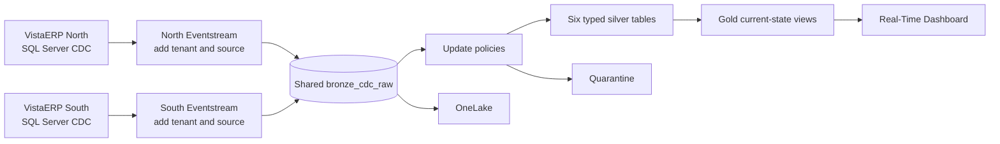

# Microsoft Fabric RTI with SQL Server CDC

This repository is a working demonstration of two independent SQL Server ERP databases feeding a shared Microsoft Fabric Real-Time Intelligence solution without losing the origin of any row. Changes arrive continuously, are validated and shaped into analytics-ready tables, and appear in a live operations dashboard.

The central safety rule is simple:

> Every landed row must carry a reliable `tenant_id` and `source_instance` injected before it reaches storage.

That rule prevents identical keys from different ERP instances from being mixed or attributed to the wrong business unit.

## What the demo proves

- SQL Server Change Data Capture (CDC) can stream inserts, updates, and deletes from private SQL Server 2022 VMs.
- Two source-specific Eventstreams can add immutable source identity before both streams converge on one shared bronze table.
- Eventhouse update policies can continuously populate typed silver tables, quarantine malformed events, and maintain current-state gold views.
- A Real-Time Dashboard can show live operational changes across ERP instances.
- An additive SQL schema change can be introduced with overlapping CDC capture instances and accepted without losing changes.
- The design provides measured promotion paths for noisy sources that outgrow the shared tier.

Change Tracking is enabled only for comparison. It is not used as a Fabric streaming source.

## Architecture



Two ingress Eventstreams are intentional. Fabric combines multiple sources into one default stream before downstream operators, so a single Eventstream cannot reliably assign a different constant identity to each source after that merge. Identity is therefore added in one source-specific stream per ERP instance, before landing in shared bronze.

## Data layers

| Layer | Purpose |
|---|---|
| Bronze | Append-only raw CDC envelope with governed source identity and flexible payload |
| Silver | Typed table-specific changes with validation and operation metadata |
| Quarantine | Events that cannot safely enter a typed silver contract |
| Gold | Materialized current-state views for operational consumption |

The sample tracks `Projects`, `JobCosts`, `WorkOrders`, `Equipment`, `Invoices`, and `DemoHeartbeat` in each `VistaERP` database.

## Repository map

| Path | Purpose |
|---|---|
| `infra/` | Bicep and Azure deployment assets for two private SQL Server VMs |
| `sql/` | ERP schema, seed data, CDC configuration, changes, reset, and schema drift |
| `scripts/` | Idempotent deployment, mutation, and validation tooling |
| `kql/` | Eventhouse bronze, silver, quarantine, update-policy, and gold definitions |
| `config/instances.example.json` | Publishable template for environment-specific Fabric and Azure identifiers |
| `docs/` | Phase guides, operations guidance, design decisions, and validation evidence |

## Prerequisites

- An Azure subscription and permission to create resource groups, role assignments, networking, VMs, Key Vault, and deployment stacks.
- A Microsoft Fabric workspace on active capacity in the same Azure region as the private connectivity resources.
- Azure CLI with the Bicep extension, Bash, PowerShell 7, and Python 3.
- Fabric workspace permissions to create connections, Eventstreams, an Eventhouse, a KQL database, and a Real-Time Dashboard.
SQL Server Developer edition is used for this nonproduction demonstration. It is not licensed for production workloads.

## Run the demonstration

### 1. Configure your environment

Copy `config/instances.example.json` to `config/instances.json` and replace every placeholder after the target Fabric objects and connections are known. The runtime file is intentionally ignored by Git because it contains environment-specific identifiers and private addresses.

Set the Azure values used by the shell scripts:

```bash
export AZURE_SUBSCRIPTION_ID="<subscription-id>"
export AZURE_RESOURCE_GROUP="<resource-group>"
export AZURE_LOCATION="<fabric-capacity-region>"
```

Review `infra/main.bicepparam` before deployment. Replace the workspace principal, owner, expiry date, address ranges, and names with values appropriate for your environment. Never place a password in a parameter file.

### 2. Deploy private Azure infrastructure

```bash
./scripts/deploy.sh
```

If `VM_ADMIN_PASSWORD` is absent, the script generates a strong credential in memory and stores it in Azure Key Vault. The SQL VMs have no public IP addresses, and TCP 1433 is allowed only from the delegated streaming connector subnet.

See [Phase 1](docs/PHASE-1-AZURE.md) for the topology, security model, cost controls, and acceptance checks.

### 3. Configure both SQL Server sources

```bash
./scripts/sql-phase2.sh bootstrap all
./scripts/sql-phase2.sh diagnostics all
```

This creates both `VistaERP` databases, seeds overlapping business keys, enables CDC and Change Tracking on six tables, and verifies SQL Agent capture and cleanup jobs. Read [SQL CDC operations](docs/SQL-CDC-OPERATIONS.md) before using the pattern against an ERP system.

### 4. Create the Fabric streaming path

Create or confirm the private Streaming VNet gateway and the two SQL CDC connections, then populate `config/instances.json`. Apply the identity-safe Eventstreams and validate the raw path as described in [Phase 3](docs/PHASE-3-FABRIC.md).

### 5. Apply the medallion model and dashboard

```powershell
./scripts/apply-medallion-demo.ps1 -Mode Apply
./scripts/validate-medallion-demo.ps1
```

The apply script is idempotent. It creates shared bronze, six silver tables, quarantine, update policies, gold current-state views, and the dashboard. The validator checks topology and identity invariants as well as the data path and OneLake availability.

### 6. Generate deterministic changes

Record the start time before changing either source, then validate only events that arrived after that point:

```powershell
$since = [DateTimeOffset]::UtcNow
./scripts/invoke-sql-operation.ps1 -Action Change -Mode Apply
./scripts/validate-medallion-demo.ps1 -SinceUtc $since -MirroringMode Healthy
```

The change updates the heartbeat, project budget, equipment meter, and work-order status, then inserts a job cost and invoice on each source. Use the heartbeat sequence and dashboard to show that both sources advance independently while retaining the correct `tenant_id` and `source_instance`.

For a complete reset, fresh-change, and validation rehearsal:

```powershell
./scripts/invoke-phase5-rehearsal.ps1 -Mode Plan
./scripts/invoke-phase5-rehearsal.ps1 -Mode Apply
```

### 7. Demonstrate schema evolution

Follow [the schema drift runbook](docs/MEDALLION-DEMO.md#schema-drift-runbook). The `PriorityCode` example creates a second, overlapping CDC capture instance before downstream acceptance, which preserves continuity during the transition.

### 8. Stop or remove resources

Deallocate both SQL VMs whenever the live demo is idle. To remove stack-managed Azure resources:

```bash
./scripts/teardown.sh
```

Fabric items and retained storage require separate lifecycle decisions. Confirm deletion scope before removing shared workspace assets.

## Performance and cost

This repository demonstrates correctness and operability, not a universal performance ranking.

- SQL CDC adds log scanning, writes to change tables, retention storage, and cleanup work. Benchmark representative ERP transactions and monitor capture lag and log reuse before production rollout.
- Fabric uses shared Capacity Units across workloads. This can reduce platform sprawl when capacity already exists, but competing workloads can also throttle one another unless guarded or isolated.
- Kafka with Debezium provides a durable, portable event-log architecture and a broad connector ecosystem, but introduces broker, connector, schema, and downstream analytics costs unless managed services absorb them.
- Databricks is strong for complex Spark transformations, data engineering, and ML on an open lakehouse. Continuous streams require appropriately sized compute and production job operations.

Use measured event rates, latency objectives, retention, concurrency, existing licenses, and team skills in a pricing calculator. See [Platform comparison](docs/PLATFORM-COMPARISON.md) for a decision framework rather than a product slogan.

## Security and production boundaries

- No credentials belong in this repository. Runtime credentials are held in Key Vault or in-memory `PSCredential` objects.
- The current Fabric SQL Server on VM CDC connector uses Basic authentication in this tested design. Treat credential rotation and connector limitations as production requirements.
- Resource IDs and private IP addresses are not secrets, but runtime manifests are excluded to avoid publishing environment inventory.
- Test backup, restore, disaster recovery, deletion semantics, access control, capacity isolation, and data retention before production use.
- Review CDC support and ERP vendor guidance for the exact SQL Server edition, topology, upgrade path, and source tables.

## Documentation

- [Demo plan and design decisions](docs/DEMO-PLAN.md)
- [Azure infrastructure](docs/PHASE-1-AZURE.md)
- [SQL Server source setup](docs/PHASE-2-SQL.md)
- [Fabric streaming and identity](docs/PHASE-3-FABRIC.md)
- [Scale and repeatability](docs/PHASE-4-SCALE.md)
- [Medallion processing and demo runbook](docs/MEDALLION-DEMO.md)
- [SQL CDC configuration and ERP impact](docs/SQL-CDC-OPERATIONS.md)
- [Fabric, Kafka/Debezium, and Databricks comparison](docs/PLATFORM-COMPARISON.md)

## Status

The reference environment has been deployed and validated end to end with two independent SQL Server 2022 sources, private connectivity, pre-landing identity, shared bronze processing, all six silver paths, gold views, a Real-Time Dashboard, OneLake exposure, and additive schema drift.

Environment-specific identifiers and validation timestamps stay outside the publishable project. Copy `config/instances.example.json` to the ignored `config/instances.json` file for your deployment, and never commit that runtime manifest.
