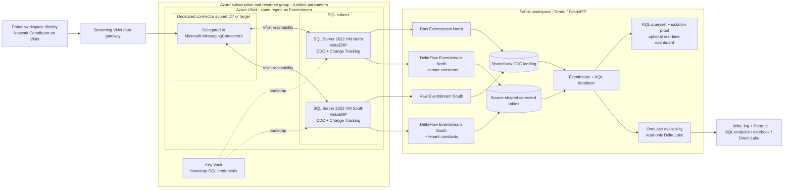

# Fabric RTI Multi-Instance SQL CDC Demo Plan

## Scope and status

This document began as the Phase 0 plan for a repeatable 25-minute customer demo. Phases 1 through 4 are deployed and validated for the live two-instance topology. The planned DeltaFlow path is blocked by the verified product constraint documented below.

Documentation was checked against current Microsoft sources on **2026-08-26**. Capabilities are labeled when they are Preview, manual, or unverified. The implementation phases described here are complete; unresolved product boundaries remain explicit.

The deployed bronze/silver/gold scenario, Real-Time Dashboard, schema drift walkthrough, and noisy-neighbor guidance are documented in `docs/MEDALLION-DEMO.md`.

### Runtime targets

| Parameter | Project contract |
|---|---|
| Fabric workspace and identity | Supplied per environment in the runtime manifest and Bicep parameters |
| Fabric capacity region | Must align with the private connectivity design |
| Fabric folder | Supplied per environment in the runtime manifest |
| SQL database name on both instances | `VistaERP` |
| Tenant IDs | `CONTOSO_NORTH`, `CONTOSO_SOUTH` |

These values are runtime inputs for this demo, not defaults to hardcode in later artifacts. Subscription, resource group, region, workspace, folder, tenant, and credentials must remain parameterized.

## Success criteria

The demo succeeds only when every corrected landed row carries non-null `tenant_id` and `source_instance` values assigned from its source instance **before Eventhouse landing**. A deterministic source-to-tenant mapping must produce zero mismatches and zero unknown tenants.

Connector metadata such as `__dbz_server`, or enrichment through a KQL update policy after landing, can help diagnose or illustrate source identity. Neither is a substitute for the required pre-landing business tenant identity.

## 25-minute narrative

### 00:00-02:00 - Frame the collision

**Say:** The customer operates about 2,500 single-tenant SQL Server ERP instances. Each tenant uses the same product database name. Consolidation fails if identity is inferred from `VistaERP`, table name, or overlapping business keys.

**Show:** The acceptance test: no corrected row may reach the analytics estate without `tenant_id` and `source_instance`, and the isolation query must return zero failures.

**Proof point:** This is source identity governance, not merely schema mapping.

**Fallback:** Use a prepared architecture slide and the saved expected isolation result if the portal is slow.

### 02:00-05:00 - Stage two identical databases

**Show:** Two independent SQL Server 2022 Azure VMs. On each server, query `DB_NAME()` and the same construction ERP tables to show:

- Both databases are named `VistaERP`.
- Both schemas contain projects, job costs, work orders, equipment, and invoices.
- Business keys intentionally overlap, such as `ProjectId = 1001`.
- North rows contain unmistakable `CONTOSO_NORTH` business markers; South rows contain `CONTOSO_SOUTH` markers.

Trigger one deterministic change on each server so the audience can follow both records through the stream.

**Proof point:** Server identity is the only reliable discriminator at source; database and row keys collide by design.

**Fallback:** Use the seeded snapshot and two prepared SQL result grids.

### 05:00-08:00 - Show naive ingestion

**Show:** Two raw CDC Eventstreams, one per VM, feeding a shared raw landing surface. Project only the database name, table name, key, and business payload. The rows become ambiguous because both sources report `VistaERP` and overlapping keys.

Then inspect a complete raw event. State accurately that Debezium's nested `source` envelope contains technical source metadata. The failure is discarding that envelope in payload-only landing or failing to govern a stable mapping from technical connector identity to business tenant identity. The claim is not that Debezium has no source clue.

**Proof point:** Raw envelopes require parsing, mapping, and a downstream normalization layer before ordinary analytics queries are safe.

**Fallback:** Show a captured raw event beside the ambiguous projection while keeping the corrected streams live.

### 08:00-13:00 - Correct identity during streaming

**Show:** Two corrected Eventstreams, one per SQL instance, using a streaming SQL projection to append governed source constants before Eventhouse landing.

For each stream, show its fixed mapping:

| Source | `tenant_id` | `source_instance` |
|---|---|---|
| North SQL VM | `CONTOSO_NORTH` | stable North instance identifier |
| South SQL VM | `CONTOSO_SOUTH` | stable South instance identifier |

Show the persisted pre-ingestion SQL transformation and the landed KQL result. DeltaFlow's connector metadata, including `__dbz_server`, remains useful for diagnostics but is not the business tenancy mechanism.

**Verified boundary:** Streaming SQL successfully injects both constants before a fixed Eventhouse destination. DeltaFlow dynamic table routing rejects the same operator topology because adding an operator changes the effective table creation mode to `Basic`; CloudEvent table variables then fail validation. Do not claim that DeltaFlow auto-managed tables currently satisfy the identity requirement. Use the validated fixed-table path until Fabric supports both capabilities together.

**Proof point:** Per-instance source configuration turns infrastructure identity into explicit, queryable business tenancy before landing.

**Fallback:** Stop this claim and explain the product gap honestly. A prevalidated alternate streaming path may be used only if it still injects both fields before Eventhouse landing.

### 13:00-17:00 - Prove isolation with KQL

**Show:** Run the saved `proof_of_isolation.kql` acceptance queries against corrected landing tables:

1. Group row and event counts by `tenant_id`, `source_instance`, and `__dbz_server`.
2. Assert null, empty, or unknown tenant/source values equal zero.
3. Assert each `source_instance` maps to exactly one `tenant_id`.
4. Compare seeded business markers with expected tenant and assert mismatches equal zero.
5. Materialize latest row per business key while handling `Insert`, `Pre_Update`, `Post_Update`, and `Delete` correctly.

Expected headline output:

| Check | Expected result |
|---|---|
| Known tenants | `CONTOSO_NORTH`, `CONTOSO_SOUTH` |
| Null or unknown identities | `0` |
| Source-to-tenant mapping conflicts | `0` |
| Cross-tenant marker mismatches | `0` |

Trigger another change on each VM and refresh the query to make the proof visibly live.

**Fallback:** Use the saved KQL queryset and a precomputed expected result, then show one deterministic live update if continuous load is unavailable.

### 17:00-21:00 - Raw Debezium versus DeltaFlow

**Show side by side:**

| Raw CDC event | DeltaFlow Preview output |
|---|---|
| Nested `before`, `after`, `source`, `op` JSON | Source table columns at the top level |
| Parsing required before normal queries | Direct KQL/SQL-friendly tabular shape |
| Destination modeling is customer work | Automatic Eventhouse destination-table creation |
| Schema handling is downstream work | Automatic schema registration and evolution |
| Technical metadata inside an envelope | `__dbz_operation`, `__dbz_timestamp`, `__dbz_server`, `__dbz_schema`, `__dbz_table` columns |

Explain operation behavior precisely: initial snapshot rows appear as `Insert`; an update emits `Pre_Update` and `Post_Update`; a delete emits `Delete` with the last known values.

**Answer “Fabric uses Debezium too”:** The differentiator is not denying the connector technology. Fabric removes the customer-managed Kafka/Confluent transport layer and DeltaFlow produces analytics-ready, source-shaped rows with managed schema and destination tables instead of requiring a custom JSON-to-silver pipeline.

**Fallback:** Use captured raw and DeltaFlow rows from the same business event.

### 21:00-24:00 - Show the open-format exit

**Show:** OneLake availability enabled for the corrected Eventhouse/KQL tables. Open **View files**, then show the `_delta_log` and Parquet files. If schema synchronization is enabled, also use **Analyze data with > SQL endpoint** or a notebook to read the Delta representation.

Set `TargetLatencyInMinutes` to five for demo tables during pre-flight. Explain that the default adaptive behavior can delay writes for up to three hours or until approximately 200-256 MB files are available; a five-minute setting favors demo visibility over optimal file sizing.

**Proof point:** The Eventhouse data is exposed as read-only Delta Lake tables in OneLake and can be consumed by other Fabric engines without exporting from a proprietary store.

**Fallback:** Show preexisting Delta files and mirroring-operation latency while separately proving that KQL ingestion remains live.

### 24:00-25:00 - Close the objections

1. **“It is Debezium underneath.”** Correct; the value is managed SaaS ingestion without the Kafka/Confluent layer, plus DeltaFlow's table-shaped landing and managed schema lifecycle.
2. **“Someone can disable CDC silently.”** The production pattern requires SQL CDC/Agent health checks, connector state, ingestion freshness, and a synthetic heartbeat. The exact automated alert signal remains a validation item; silence is not treated as success.
3. **“Change Tracking is lighter.”** Measure CDC and Change Tracking side by side on the host. Change Tracking can be appropriate when only current state matters, but it is not currently a supported Eventstream source. Do not imply otherwise.
4. **“Open format is non-negotiable.”** Show the `_delta_log` and Parquet files. The demonstrated contract is Delta Lake; native Iceberg requirements must be clarified separately.

Close on scale: the pattern is one deterministic instance manifest entry per tenant, generating source identity, connection binding, and Eventstream definition across hundreds of instances, subject to the automation boundaries validated in Phase 4.

## Architecture

The supported private SQL VM path is Streaming VNet data gateway injection into a `Microsoft.MessagingConnectors` delegated subnet with VNet reachability to the SQL VMs. Fabric Eventstream managed private endpoints are not used here because current documentation limits those endpoints to Azure Event Hubs and Azure IoT Hub.

## Component inventory

### Azure

| Component | Purpose | Lifecycle/ownership |
|---|---|---|
| Existing subscription and resource group | Deployment boundary | Runtime parameters; never embedded in templates |
| Resource providers | VM, network, Key Vault, and `Microsoft.MessagingConnectors` support | Registration checked idempotently |
| VNet and SQL subnet | Private VM network | Deployed and completely removed with the demo |
| Connector subnet | Eventstream connector injection | Dedicated `/27` or larger; delegated to `Microsoft.MessagingConnectors` |
| NSGs | Restrict SQL and administrative traffic | No general public SQL ingress |
| Two SQL Server 2022 Developer VMs | Independent tenant ERP sources | Auto-shutdown outside demo windows; no named-instance shortcut |
| NICs, managed disks, SQL IaaS Agent | VM networking, persistence, SQL management | Included in teardown and cost estimate |
| Key Vault | Generate/store bootstrap SQL credentials | No secret values in source or parameter files |

SQL Server Developer edition is the proposed nonproduction demo edition and must not be used for production workloads. A public administration path is excluded by default; any emergency public route requires explicit approval and narrow restrictions.

### Fabric

| Component | Count | Status/purpose |
|---|---:|---|
| Existing capacity-backed workspace | 1 | Region/SKU discovery is a pre-flight gate |
| Nested folder path | 3 levels | `Dev/Demo/FabricRTI`; Folder REST API is Preview |
| Workspace identity | 1 | Network Contributor on the connector VNet |
| Streaming VNet data gateway | 1 | Deployed by REST and bound to `streaming-connectors` |
| SQL Server connections | 2 | Deployed by REST; Basic auth, unencrypted transport setting required by the connector, mandatory connection tests passed |
| Event schema sets | As generated/required | Used by schema-enabled CDC and DeltaFlow |
| Raw CDC Eventstreams | 2 | Live corrected path, one per VM; streaming SQL injects tenant identity before landing |
| DeltaFlow Eventstreams | 0 | Blocked: pre-landing operator and dynamic auto-table mode are incompatible in the validated topology |
| Eventhouse and KQL database | 1 each | Raw comparison and corrected analytics landing |
| KQL queryset | 1 | Isolation acceptance test and latest-row queries |
| Real-time dashboard | 0 or 1 | Optional scripted asset if current API definition is validated |
| OneLake availability | Corrected tables | Read-only Delta Lake representation and optional schema synchronization |

Current SQL Server on VM CDC documentation supports only **Basic authentication** and explicitly says not to select **Use encrypted connection**. This conflicts with the preferred managed identity/Entra posture and must be stated in the demo security discussion. Later automation may retrieve a secret from Key Vault and securely create the Fabric connection, but direct Key Vault references from Eventstream connections are unverified.

## Risk and pre-flight checklist

| Check before rehearsal | Failure symptom | Prevention | Live fallback |
|---|---|---|---|
| Discover capacity region/SKU; confirm active capacity, F4+ recommendation, workspace access, Contributor, and required Admin rights | Items unavailable, throttled, or network settings hidden | Record region/SKU and permissions at least one day before demo | Warm alternate workspace; prepared screenshots and data |
| VNet and Eventstream regions match | Streaming gateway cannot be selected or source stays inactive | Deploy Azure resources only after workspace region discovery | Use a pre-staged gateway in the correct region |
| VNet avoids `10.240.0.0/16` and `10.224.0.0/12`; connector subnet is dedicated `/27`+ with at least 16 free addresses | Gateway provisioning or connector scaling fails | Validate address plan and subnet emptiness before deployment | Recreate only the connector subnet from a reserved CIDR |
| `Microsoft.MessagingConnectors` registered; workspace identity enabled and Network Contributor assigned | Gateway creation or VNet injection is denied | Pre-register provider and verify role assignment propagation | Preserve a pre-created gateway between demo resets |
| SQL TCP/IP, fixed port, Windows firewall, NSGs, DNS/addresses, and VNet reachability work | Connector timeout | Test private reachability from the connector network before Fabric setup | Narrow, time-boxed public route only if security policy explicitly permits |
| SQL Agent runs; database/table CDC enabled; capture/cleanup jobs healthy | Snapshot works but changes stop, or no feed appears | Run diagnostic pre-flight and retain adequate log/CDC history | Restart Agent/jobs and use a known-good table plus seeded snapshot |
| CDC login has required permissions; Basic credential is current | Authentication failure | Rotate through Key Vault workflow and test stored Fabric connection | Use a prevalidated connection; never expose the credential on screen |
| Streaming gateway and SQL connections exist; gateway test behavior is understood | Gateway absent from connection picker | Create and share gateway ahead of rehearsal; skip unsupported test connection when required | Reuse pre-created connection or approved emergency route |
| DeltaFlow Preview and event schema sets are exposed in the tenant/region | Schema handling option absent | Confirm feature availability before building the demo | Captured raw/tabular comparison; do not pretend Preview is available |
| Selected SQL types work with DeltaFlow and destination auto-creation | Schema registration or destination creation errors | Keep demo schema to validated types; rehearse schema evolution | Route a prevalidated subset of tables |
| Manage Fields can inject literals into DeltaFlow without breaking managed schemas | `tenant_id` absent, authoring error, or tables not auto-managed | Validate in a disposable stream before Phase 3 implementation | Stop the identity claim; use only a genuinely pre-landing validated alternative |
| Four connectors can coexist against the same CDC tables | Repeated snapshots, capacity pressure, or source overhead | Measure concurrent raw/DeltaFlow behavior and offsets in rehearsal | Pause raw streams after the comparison segment |
| Isolation KQL returns zero nulls, conflicts, and marker mismatches | Acceptance query returns nonzero failures | Seed deterministic markers and save the queryset | Show saved expected output, then diagnose rather than conceal failure |
| OneLake availability, backfill, schema synchronization, and five-minute table latency are ready | No recent Parquet or SQL endpoint | Enable before showtime and inspect mirroring operations | Show existing Delta files and live KQL ingestion separately |
| Load generator, clocks, and deterministic manual updates work; auto-shutdown is disabled | No visible event or VM powers off | Start and observe load before audience joins | Execute one prepared update on each source |
| Capacity and Eventstream health are stable | Latency spikes or inactive source | Warm all items and capture baseline metrics | Switch to seeded/saved results while retaining architecture walkthrough |

## CDC fragility guardrail

The demo must visibly include a health view rather than merely asserting that CDC is reliable. Its minimum signals are:

- SQL Agent state and CDC capture/cleanup job state.
- `is_cdc_enabled` at database and tracked-table metadata at table level.
- Last captured LSN/progress and transaction-log/CDC backlog indicators.
- Eventstream source state and most recent event timestamp.
- Destination ingestion freshness by source instance.
- A synthetic heartbeat or deterministic change whose absence raises an alert.

The exact alert integration is intentionally open until current Fabric monitoring APIs and connector signals are validated. The fallback is an external scheduled health script that fails loudly; silent inactivity is never an acceptable state.

## Phase gates and acceptance criteria

| Phase | Gate before review approval |
|---|---|
| Phase 1 - Azure | Both private SQL endpoints are reachable through the documented connector-network topology; deployment and complete teardown are repeatable; no secrets exist in files; one-day cost and auto-shutdown are documented. |
| Phase 2 - SQL | Both `VistaERP` databases have identical DDL and visibly distinct data; CDC and Change Tracking are enabled on the same tables; live changes and host-overhead diagnostics are repeatable. Change Tracking remains comparison-only, not an Eventstream source. |
| Phase 3 - Fabric | Identity-safe raw path complete: both streams are live, `tenant_id` and `source_instance` are injected before Eventhouse landing, source mapping has zero failures, and both tables report completed OneLake mirroring with zero latency or pending bytes. DeltaFlow coexistence is a verified product gap. |
| Phase 4 - Scale | Complete: manifest-driven Plan and Apply report six resources present and zero creates; fresh item creation polls Fabric long-running operations and returns concrete IDs; validators discover those IDs by governed names. |
| Phase 5 - Assets | Complete: live-topology rehearsal passed in 237.3 seconds with reset in 127.4 seconds; isolated empty-to-live creation proved fresh identity-safe arrivals, strict OneLake drain, idempotency, and cleanup with no residual workspace, files, or VNet role. |

## Open technical questions

These questions are unresolved from current public documentation and must not be guessed.

| Question | Owner/validation method |
|---|---|
| Can pre-landing literal injection coexist with DeltaFlow automatic table management? | **Resolved: no in the validated public-definition topology.** A streaming SQL operator persists and lands constants correctly with a fixed table. Dynamic `{CloudEventType}_{CloudEventSchemaVersion}` routing then fails because the effective table creation mode becomes `Basic`. |
| Does a SQL Server VM CDC source with pre-landing identity round-trip through the Eventstream public definition/API? | **Resolved: yes.** Both live definitions export with `SQLServerOnVMDBCDC`, the source connection ID, and the persisted SQL constant projection. |
| Which SQL CDC source properties and DeltaFlow settings are supported in the documented Eventstream definition rather than only the UI? | Fabric automation: compare official schema/template with an exported live item. |
| How can SQL connection credentials be created and rotated programmatically, and can a Fabric connection directly reference Key Vault? | **Partially resolved.** Connections REST creation works. This deployment securely bridged the secret through an authorized VM managed identity; direct Key Vault references require a Key Vault connection ID and remain a Phase 4 improvement. |
| Is Streaming VNet data gateway creation supported by a public REST API? | **Resolved: yes.** `POST /v1/gateways` created a `StreamingVirtualNetwork` gateway against the delegated subnet. |
| What capacity region and SKU back the supplied workspace? | Workspace admin: discover during pre-flight; do not infer it from the workspace name or Azure region. |
| Is DeltaFlow Preview and event schema-set support enabled in that capacity region and tenant, and are Preview terms acceptable for the customer demo? | Workspace admin/product owner: verify in the portal and with Preview governance. |
| Do simultaneous raw and DeltaFlow connectors against the same CDC tables create independent snapshots/offsets or material extra host load? | SQL/RTI: measure during rehearsal with the Phase 2 diagnostic script. |
| Which signal provides the fastest reliable alert when CDC is disabled: SQL metadata/job polling, Eventstream health, monitoring API, ingestion freshness, or heartbeat? | RTI operations: fault-inject CDC disablement and measure detection time for each supported signal. |
| Does the customer accept Delta Lake for the stated “Iceberg/Delta” requirement, or require native Iceberg metadata? | Customer architecture owner: clarify before the final talk track; claim only Delta Lake in this demo. |
| Can the real-time dashboard definition be created and updated through a supported API in the target tenant? | Fabric automation: validate KQL Dashboard definition import/export before scripting. |

## Verified documentation baseline

- [SQL Server on VM CDC source](https://learn.microsoft.com/en-us/fabric/real-time-intelligence/event-streams/add-source-sql-server-change-data-capture)
- [DeltaFlow output transformation (Preview)](https://learn.microsoft.com/en-us/fabric/real-time-intelligence/event-streams/delta-flow-output-transformation)
- [Eventstream private-network support guide](https://learn.microsoft.com/en-us/fabric/real-time-intelligence/event-streams/streaming-connector-private-network-support-guide)
- [Streaming virtual network data gateway](https://learn.microsoft.com/en-us/fabric/real-time-intelligence/event-streams/create-manage-streaming-virtual-network-data-gateways)
- [Eventstream managed private endpoints](https://learn.microsoft.com/en-us/fabric/real-time-intelligence/event-streams/set-up-private-endpoint)
- [Event processing editor](https://learn.microsoft.com/en-us/fabric/real-time-intelligence/event-streams/process-events-using-event-processor-editor)
- [Eventstream REST definition](https://learn.microsoft.com/en-us/rest/api/fabric/articles/item-management/definitions/eventstream-definition)
- [Create Eventstream REST API](https://learn.microsoft.com/en-us/rest/api/fabric/eventstream/items/create-eventstream)
- [Create Eventhouse REST API](https://learn.microsoft.com/en-us/rest/api/fabric/eventhouse/items/create-eventhouse)
- [Create Folder REST API (Preview)](https://learn.microsoft.com/en-us/rest/api/fabric/core/folders/create-folder)
- [OneLake availability for Eventhouse](https://learn.microsoft.com/en-us/fabric/real-time-intelligence/event-house-onelake-availability)

## Original Phase 0 approval gate

The original project gate required this plan to be reviewed before Phase 1 began. The repository now contains the completed implementation and its validation evidence.
