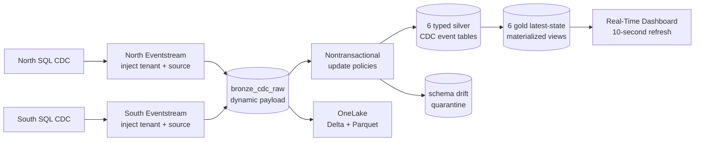

# Fabric RTI medallion demo

## Implemented topology



Fabric Eventstream allows multiple sources but only one default stream. The sources merge before Eventstream operators, and the SQL Server CDC envelopes use the same generic connector identity. A single Eventstream therefore cannot assign a reliable per-instance business identity after that merge.

The deployed topology keeps one ingress Eventstream per SQL instance so each branch injects `tenant_id` and `source_instance` before landing. Both Eventstreams converge on one shared bronze table. This preserves the hard identity contract while centralizing Eventhouse processing.

## Bronze, silver, and gold

`bronze_cdc_raw` retains the complete Debezium-style `schema` and `payload` as dynamic columns plus the governed identity fields and Eventstream timestamps. It is append-only with seven-day hot retention and OneLake mirroring.

Seven nontransactional update policies read bronze ingestion extents:

- Six policies route `Projects`, `Equipment`, `WorkOrders`, `JobCosts`, `Invoices`, and `DemoHeartbeat` into typed silver CDC event tables.
- One policy sends missing identity, unknown source tables, and unexpected WorkOrders fields to `schema_drift_quarantine`.

Six materialized views use `arg_max(processed_utc, *)` to expose the latest row per tenant and business key. Consumers must filter `is_deleted` when they need active state only.

## Real-Time Dashboard

The deployed dashboard is **ERP Live Operations**. Its environment-specific item ID is stored in the ignored runtime manifest. It refreshes every 10 seconds and contains:

- CDC events by tenant
- CDC event rate
- Current work orders by status
- Latest operational changes
- Project budget by tenant
- Schema drift quarantine

Open the dashboard by name from the target Fabric workspace.

## Schema drift demonstration

The example adds nullable `PriorityCode` to North `dbo.WorkOrders` and creates a second CDC capture instance so SQL Server captures the expanded schema.

```powershell
$since = [DateTimeOffset]::UtcNow
.\scripts\invoke-sql-operation.ps1 -Action SchemaDrift -Target north -Mode Apply
```

Before acceptance:

- Bronze continues ingesting because the row image is dynamic.
- Existing silver processing and unrelated tables continue.
- Quarantine records `unexpected_fields=["PriorityCode"]`.

Accept the field into typed silver:

```powershell
.\scripts\apply-schema-drift-acceptance.ps1 -Mode Apply
.\scripts\invoke-sql-operation.ps1 -Action SchemaDrift -Target north -Mode Apply
```

The second event populates `silver_work_orders.PriorityCode` and produces no new WorkOrders quarantine row. The demo has been executed with `SAFETY_CRITICAL` and `STANDARD` values.

For production, retire the old SQL CDC capture instance only after all consumers have moved past its high LSN. Do not drop it immediately during the demonstration.

## Performance constraints

Update policies run synchronously with extent ingestion even when `IsTransactional=false`. They add CPU and I/O to the ingestion path. This design performs seven policy queries and up to two downstream writes per bronze extent. Keep projections simple, filter on `payload.source.table` first, avoid joins in update policies, and move expensive enrichment to materialized views or scheduled processing.

Materialized views consume capacity while maintaining current state. `arg_max` by tenant and business key is appropriate for this data volume, but high-cardinality tenants and frequent updates increase maintenance cost. Monitor materialized-view health and query the materialized portion for latency-sensitive visuals.

Dashboard refresh is a recurring query workload. A 10-second interval is appropriate for a short demonstration, not the default production setting. Use 30-60 seconds for operational dashboards unless the SLA requires faster refresh. Add time and tenant parameters so filters are applied at the start of each query.

One shared bronze table improves operational simplicity but creates a common ingestion and retention domain. A hot tenant can increase extent creation, update-policy work, cache churn, and dashboard latency for every tenant.

## Cost model

The main Fabric capacity consumers are:

- Eventstream source and transformation runtime
- Bronze ingestion and hot-cache retention
- Silver write amplification from update policies
- Gold materialized-view maintenance
- OneLake mirroring and retained Parquet data
- Dashboard refresh queries and concurrent viewers

Bronze plus silver intentionally duplicates data. Gold materialized views add another maintained copy of current state. Keep bronze hot retention short, retain long history in OneLake, and mirror only tables with a downstream requirement. Increase dashboard refresh intervals outside live demonstrations.

## Noisy-neighbor isolation

Use measured tenant event rate, ingestion latency, policy latency, cache hit rate, throttling, and dashboard p95 query latency to assign an isolation tier:

| Tier | Recommended boundary | Use when |
|---|---|---|
| Shared | Shared bronze and KQL database | Low-volume tenants with similar retention and SLA |
| Partitioned ingress | Dedicated Eventstream and raw table, shared KQL database | A tenant has bursty ingestion or needs independent replay |
| Database isolated | Dedicated KQL database in the same Eventhouse | Different retention, permissions, workload policies, or operational ownership |
| Eventhouse isolated | Dedicated Eventhouse/capacity | Strict SLA, sustained high volume, regulated data, or hard failure/capacity isolation |

Recommended promotion signals are sustained ingestion latency above the SLA, repeated capacity throttling, one tenant exceeding 25% of shared ingestion volume, or a tenant causing materialized-view/dashboard p95 latency to double. The 25% value is an operating starting point, not a Fabric product limit; tune it from measured capacity behavior.

Identity remains the first isolation boundary. Every table and dashboard query must retain or filter `tenant_id`; infrastructure isolation does not replace row-level governance.

## Commands

```powershell
# Idempotent plan and deployment
.\scripts\apply-medallion-demo.ps1 -Mode Plan
.\scripts\apply-medallion-demo.ps1 -Mode Apply

# Topology, data, dashboard, gold, and OneLake validation
.\scripts\validate-medallion-demo.ps1 -MirroringMode Healthy
.\scripts\validate-phase3.ps1 -MirroringMode Drained

# Fresh two-instance change and validation
$since = [DateTimeOffset]::UtcNow
.\scripts\invoke-sql-operation.ps1 -Action Change -Mode Apply
.\scripts\validate-medallion-demo.ps1 -SinceUtc $since -MirroringMode Healthy
```