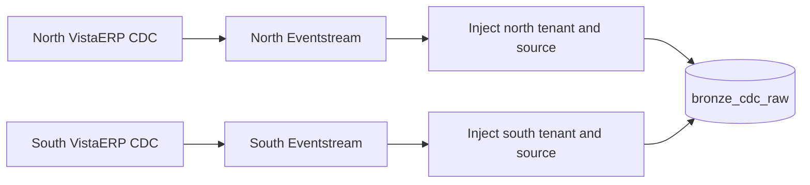

# Phase 3 - Fabric streaming and identity-safe landing

## Scope and status

Phase 3 creates the private SQL Server CDC connections and two source-specific Eventstreams that converge on the shared Eventhouse bronze table. The reference environment was deployed and validated with both `VistaERP` sources, zero missing identities, and OneLake availability.

Environment-specific IDs, endpoints, and private addresses belong in the ignored `config/instances.json` runtime manifest. Start from `config/instances.example.json` when deploying another environment.

## Why there are two Eventstreams

Fabric supports multiple sources in one Eventstream, but those sources feed one default stream before downstream operators. The SQL Server CDC envelopes do not provide this project's governed business identity. Once two otherwise identical ERP feeds are merged, a downstream constant expression cannot determine which source should receive `CONTOSO_NORTH` or `CONTOSO_SOUTH`.

The topology therefore uses one ingress Eventstream for each SQL instance:



Each Eventstream has exactly one SQL Server on VM CDC source, one SQL operator, one derived stream, and one Eventhouse destination. The SQL operator appends fixed `tenant_id` and `source_instance` values. The destination reads only from that derived stream and writes to the shared `bronze_cdc_raw` table.

This boundary is mandatory: source identity must be present before landing. Names inside mutable ERP business data are useful evidence but are not accepted as tenancy controls.

## Private connection path

Both SQL VMs have private addresses only. Fabric reaches TCP 1433 through a Streaming VNet data gateway attached to the dedicated `/27` subnet delegated to `Microsoft.MessagingConnectors/connectors`.

The SQL Server CDC connection configuration used by the reference environment has these characteristics:

- Source type `SQLServerOnVMDBCDC`.
- Database `VistaERP`.
- Basic SQL authentication using the least-privilege `fabriccdc` login.
- Private route through the delegated Streaming VNet gateway.
- Initial snapshot followed by continuous CDC changes.
- Six source tables selected in each connection.

Do not expose the credential in scripts, command-line arguments, screenshots, or the manifest. Connection creation accepts an in-memory `PSCredential` only when a named connection does not already exist. Review current connector authentication and encryption support before production use.

## Runtime manifest

Create the local manifest from the publishable template:

```powershell
Copy-Item ./config/instances.example.json ./config/instances.json
```

Populate Fabric workspace, folder, gateway, connection, Eventstream, Eventhouse, queryset, dashboard, and query-endpoint values. Also set the private SQL endpoint and governed identity for each instance. The file is ignored by Git because it exposes environment inventory, although it must never contain credentials.

The processing contract must remain:

```json
{
	"streaming": {
		"topology": "PerSourceIngressSharedBronze",
		"rawTable": "bronze_cdc_raw",
		"identityBoundary": "EventstreamBeforeLanding"
	}
}
```

## Apply

The medallion deployment script plans by default. Inspect the plan first, then apply:

```powershell
./scripts/apply-medallion-demo.ps1 -Mode Plan
./scripts/apply-medallion-demo.ps1 -Mode Apply
```

The apply operation confirms or updates both source-specific Eventstream definitions, creates Eventhouse processing objects from `kql/medallion_processing.kql`, enables OneLake availability on bronze, and creates or updates the Real-Time Dashboard.

## Validation

Validate the raw private path and the complete medallion model:

```powershell
./scripts/validate-phase3.ps1 -MirroringMode Drained
./scripts/validate-medallion-demo.ps1 -MirroringMode Healthy
```

The checks prove:

- The gateway references the intended delegated subnet.
- Both named SQL connections exist and match the expected connection type and gateway.
- Each Eventstream has one source and injects its exact fixed identity before the destination.
- Both destinations land in `bronze_cdc_raw` through the derived stream.
- Bronze and every silver table contain both expected tenants and sources with no empty identity.
- All gold views return current state for both tenants.
- The dashboard definition contains the expected queries and automatic refresh.
- OneLake mirroring is enabled and healthy, or fully drained when strict mode is requested.

For a fresh behavioral proof, record a timestamp, generate changes on both sources, and validate only data processed after that point:

```powershell
$since = [DateTimeOffset]::UtcNow
./scripts/invoke-sql-operation.ps1 -Action Change -Mode Apply
./scripts/validate-medallion-demo.ps1 -SinceUtc $since -MirroringMode Healthy
```

After the demonstration, reset mutable rows to the baseline if repeatability is required:

```powershell
./scripts/invoke-sql-operation.ps1 -Action Reset -Mode Apply
```

## DeltaFlow boundary

Automatic dynamic table routing was evaluated but is not used. In the tested Eventstream definition, introducing the required SQL identity operator changed the effective destination behavior so automatic table routing was rejected. Connector metadata or post-landing enrichment cannot substitute for pre-landing business identity.

The shared dynamic bronze pattern is the accepted design: identity remains correct, raw envelopes remain available for replay and schema inspection, and typed routing happens in Eventhouse update policies.

## Failure handling

- If one connection or Eventstream stops, the other source can continue into shared bronze. Alert on per-source heartbeat age so aggregate traffic does not hide the outage.
- If an identity field is empty, the event violates the landing contract. Stop promotion and investigate the Eventstream definition; do not infer identity from source rows after landing.
- If a typed payload is unknown or malformed, bronze remains durable and the update policy routes it to `schema_drift_quarantine`.
- If Fabric capacity is throttled, both tenants can be affected by the shared Eventhouse path. Use the isolation tiers in `docs/MEDALLION-DEMO.md` when measured behavior breaches the service objective.
- If the SQL consumer outage approaches CDC retention, restore the connection before cleanup advances beyond the required LSN. Source-side monitoring is defined in `docs/SQL-CDC-OPERATIONS.md`.

## Production review gate

Before production approval, prove private DNS/routing, credential rotation, least privilege, capacity sizing, source CDC overhead, duplicate handling, retention and replay, schema transitions, dashboard authorization, disaster recovery, and noisy-neighbor controls. Keep Change Tracking comparison-only unless a separate design explicitly adopts its different contract.